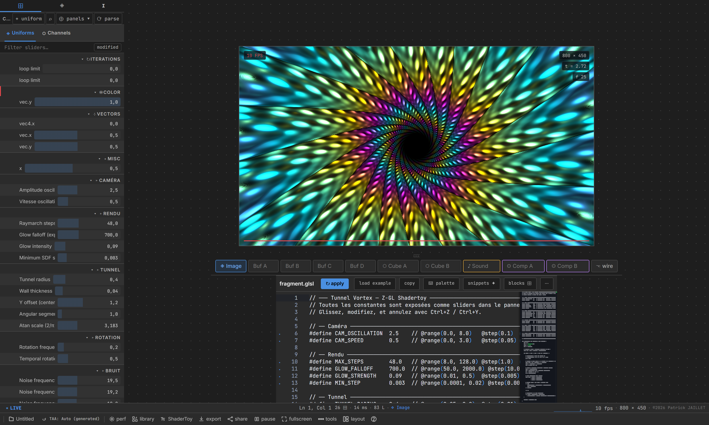

# z-gl

**z-gl** is a real-time GLSL shader editor, compatible with the ShaderToy format. Write GLSL code and see the result rendered instantly in a WebGL preview.

---

## Getting started

### Desktop app

Run the installer (`.exe` on Windows) and open z-gl like any other software. Updates are offered automatically.

---

## First steps

1. **Write your shader** in the code editor (left). Syntax highlighting, autocompletion, and errors are shown live.
2. **Watch the result** in the viewport (right) — it updates automatically, or press `Ctrl+Enter` to force a compile.
3. **Adjust parameters** (uniforms) with the sliders generated automatically from your code.
4. **Export or share** your creation once you're happy with it.

---

## Main features

### File & projects
- New / Open / Save / Save As (`Ctrl+N`, `Ctrl+O`, `Ctrl+S`, `Ctrl+Shift+S`)
- Live tracking of an externally-modified file
- Multi-project workspace with browser, autosave, and thumbnails (`Ctrl+Shift+W`)
- Version history (`Ctrl+Shift+Z`)

### Import & library
- Direct import from ShaderToy (paste a URL or an ID)
- Library of ready-to-use shaders and presets
- Built-in examples to get started quickly

### Export & sharing
- Screenshot (PNG), video export
- Standalone HTML export, raw or minified GLSL
- Export as a Three.js snippet
- Export in ShaderToy or GLSLSandbox format
- Export a full project as a `.zip`
- Quick share link

### Advanced editing
- Monaco-based editor (the engine behind VS Code): highlighting, autocompletion, inline errors
- Drag-and-drop GLSL block palette (`Ctrl+Shift+K`)
- Command palette (`Ctrl+Shift+P`)
- Code-focus mode, fullscreen viewport (`F11`)
- Cross-reference GLSL/WGSL/HLSL documentation on hover (`F1`)
- Scrub numeric values directly in the code: click-and-drag on the number, `Shift` for a fine step, `Ctrl` for a coarse step

### Uniforms & sliders
- Sliders generated automatically for every declared uniform, styled as scrubbable After-Effects-style numeric fields
- Pin favorite sliders, reset, randomize (`Alt+R`)
- Ray Marching assistant: automatically detects SDF scenes and offers dedicated controls (`Ctrl+Shift+M`)

### Post-processing & style
- Stackable FX effect pile
- Global color palette (LUT-based recoloring — over 50 LUTs available, `Ctrl+Shift+L`)
- Warp (UV deformation) effects, style layers, and shape masks

### Multi-pass
- Manage multiple render passes
- Visual wiring panel between passes (buffers/channels)

### Comfort & accessibility
- Color-blindness simulation: protanopia, deuteranopia, tritanopia (`Ctrl+Shift+B`)
- Performance panel (FPS cap, resolution) (`Ctrl+Shift+G`)
- Pop the viewport out into a second window (useful for dual-screen or live setups)
- Presentation mode, layout presets

---

## Useful keyboard shortcuts

| Shortcut | Action |
|---|---|
| `Ctrl+N` / `Ctrl+O` / `Ctrl+S` | New / Open / Save |
| `Ctrl+Enter` | Compile and apply |
| `F11` | Viewport fullscreen |
| `Ctrl+scroll` | Zoom the viewport |
| `Alt+R` | Randomize unpinned sliders |
| `Ctrl+Z` / `Ctrl+Y` | Undo / redo (sliders) |
| `Ctrl+Shift+P` | Command palette |
| `Ctrl+Shift+K` | GLSL block palette |
| `Ctrl+Shift+W` | Multi-project workspace |
| `Ctrl+Shift+B` | Color-blindness simulation |
| `Ctrl+Shift+M` | Ray Marching assistant |
| `Ctrl+Shift+L` | LUT library |
| `Ctrl+Shift+G` | Performance settings |
| `Ctrl+E` | Export an image |
| `Alt+1` / `Alt+3` / `Alt+4` | Sidebar tabs (Uniforms / Style / History) |

---

## Need help?

A help center and a getting-started guide are available directly from the interface (help button in the toolbar).
